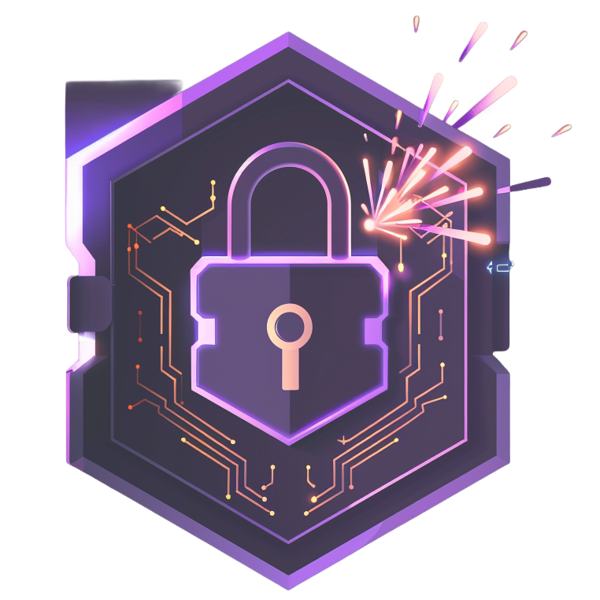

# 🔐 My Vault - Secure Key Manager

<div align="center">
  
  
  **Your personal secure vault for API keys, applications, and bookmarks**
  
  [](https://www.docker.com/)
  [](https://web.dev/progressive-web-apps/)
  [](https://www.typescriptlang.org/)
  [](https://reactjs.org/)
  [](https://github.com/webdevtodayjason/MyVault)
</div>

## ✨ Features

### 🔒 Security First
- **Biometric Authentication**: Use fingerprint or face recognition for secure access
- **PIN Protection**: 6-digit PIN code as fallback authentication
- **YubiKey Support**: Hardware security key integration
- **Encrypted Storage**: All data stored locally with encryption
- **Session Timeout**: Auto-lock after 30 minutes of inactivity

### 📱 Progressive Web App (PWA)
- **Install as App**: Add to home screen on any device
- **Offline Support**: Works without internet connection
- **Auto Updates**: Seamlessly updates in the background
- **Native Feel**: Full-screen experience with app-like interface

### 🗂️ Data Management
- **Applications**: Track all your apps with descriptions and URLs
- **API Keys**: Securely store and manage API keys with masked display
- **Bookmarks**: Organize important links with tags
- **Import/Export**: Multiple format support (JSON, CSV, Markdown)
- **Smart Search**: Filter and search across all your data
- **Edit Modal**: Edit any item inline with a beautiful modal interface

### 🎨 Beautiful UI
- **Glass Morphism**: Modern translucent design with blur effects
- **Pink Glow Theme**: Distinctive pink accent with glow effects
- **Dark Mode**: Easy on the eyes with dark background
- **Responsive Design**: Works perfectly on desktop and mobile

## 🚀 Quick Start

### Option 1: Docker (Recommended)

```bash
# Clone the repository
git clone https://github.com/webdevtodayjason/MyVault.git
cd MyVault

# Run with Docker Compose
docker-compose up -d

# Access at http://localhost:3000
```

### Option 2: Docker Build

```bash
# Build the image
docker build -t my-vault .

# Run the container
docker run -d -p 3000:80 --name my-vault my-vault

# Access at http://localhost:3000
```

### Option 3: Local Development

```bash
# Clone the repository
git clone https://github.com/webdevtodayjason/MyVault.git
cd MyVault

# Install dependencies
npm install

# Start development server
npm run dev

# Build for production
npm run build

# Preview production build
npm run preview
```

## 📦 Installation Guide

### System Requirements
- Node.js 18+ (for local development)
- Docker & Docker Compose (for containerized deployment)
- Modern web browser with WebAuthn support

### First Time Setup

1. **Access the Application**
   - Navigate to `http://localhost:3000`
   - You'll see the lock screen

2. **Initial PIN Setup**
   - Default PIN: `445566`
   - Change it in Settings after first login

3. **Configure Biometrics**
   - Go to Settings → Security
   - Click "Add Biometric"
   - Enter admin PIN: `999999`
   - Follow browser prompts

4. **Start Adding Your Data**
   - Applications: Track apps and services
   - API Keys: Store keys securely
   - Bookmarks: Save important links

## 🐳 Docker Deployment

### Docker Compose Configuration

```yaml
version: '3.8'

services:
  my-vault:
    build: .
    container_name: my-vault
    ports:
      - "3000:80"
    volumes:
      - vault-data:/data
    environment:
      - NODE_ENV=production
    restart: unless-stopped
```

### Environment Variables

Create a `.env` file for custom configuration:

```env
PORT=3000
NODE_ENV=production
```

### Building for ARM/x86

```bash
# Build for multiple architectures
docker buildx build --platform linux/amd64,linux/arm64 -t my-vault .
```

## 📱 PWA Installation

### Desktop (Chrome/Edge)
1. Visit the application
2. Click the install icon in the address bar
3. Follow the installation prompts

### Mobile (iOS)
1. Open in Safari
2. Tap the Share button
3. Select "Add to Home Screen"

### Mobile (Android)
1. Open in Chrome
2. Tap the menu (three dots)
3. Select "Install app"

## 🔧 Configuration

### Security Settings

Edit `src/config/auth.config.ts`:
```typescript
export const authConfig = {
  pin: '445566',      // Change this
  adminPin: '999999'  // Change this
};
```

### Theme Customization

Edit `src/globals.css`:
```css
/* Customize pink glow effects */
.glass-pink-glow {
  @apply text-pink-500 font-semibold;
  text-shadow: 0 0 10px rgba(236, 72, 153, 0.5);
}
```

## 📊 Data Import/Export

### CSV Format
```csv
"Type","Name","Description","URL","API Key ID","Tags"
"Application","GitHub","Version control","https://github.com","***","development,git"
"API Key","OpenAI","GPT API","","sk-***","ai,llm"
"Bookmark","Documentation","","https://docs.example.com","","docs,reference"
```

### Supported Types
- **Application**: Any app or service
- **API Key**: Standalone API keys
- **Bookmark**: Web links with tags
- **Custom Types**: AI/LLM, WordPress Theme, etc.

### Import Notes
- CSV files with API Key ID create linked Application + API Key
- Tags can be comma-separated or pipe-separated
- Masked keys (***) are accepted

## 🔐 Security Best Practices

### Important Notes
- All data stored locally in browser (IndexedDB)
- No cloud sync or external servers
- Biometric data never leaves device
- Export regularly for backup

### Recommendations
1. Change default PINs immediately
2. Enable biometric authentication
3. Regular backups via export
4. Use unique names for items
5. Don't share Docker volumes

## 🛠️ Development

### Tech Stack
- **Frontend**: React 18 + TypeScript
- **Styling**: Tailwind CSS + Shadcn/ui
- **Build**: Vite
- **Database**: IndexedDB
- **Auth**: WebAuthn API
- **PWA**: Vite PWA Plugin
- **Container**: Docker + Nginx

### Project Structure
```
my-vault/
├── src/
│   ├── components/     # React components
│   │   ├── ui/        # Shadcn components
│   │   ├── EditModal.tsx
│   │   ├── ExportImportModal.tsx
│   │   └── LockScreen.tsx
│   ├── pages/         # Page components
│   ├── hooks/         # Custom hooks
│   ├── services/      # Business logic
│   ├── utils/         # Utilities
│   └── config/        # Configuration
├── public/            # Static assets
├── docker-compose.yml # Docker config
├── Dockerfile        # Container build
└── package.json      # Dependencies
```

### Adding Features

1. **New Component**:
```tsx
// src/components/NewFeature.tsx
export const NewFeature = () => {
  return <div className="glass-pink-glow">...</div>
}
```

2. **New Data Type**:
- Update types in Dashboard.tsx
- Add to useDatabase hook
- Update dataConverters.ts

## 🤝 Contributing

1. Fork the repository
2. Create feature branch: `git checkout -b feature/amazing`
3. Commit changes: `git commit -m 'Add amazing feature'`
4. Push branch: `git push origin feature/amazing`
5. Open Pull Request

## 📝 License

MIT License - Use freely for personal or commercial purposes.

## 🐛 Troubleshooting

### Common Issues

**Biometric not working**
- Ensure HTTPS or localhost
- Check browser WebAuthn support
- Try different browser

**Data not persisting**
- Check browser storage settings
- Disable private/incognito mode
- Clear browser cache

**Docker not starting**
```bash
# Check logs
docker logs my-vault

# Verify port availability
lsof -i :3000
```

**PWA not installing**
- Requires HTTPS in production
- Check manifest.json validity
- Clear service worker cache

## 🚀 Deployment Options

### Railway
See included Railway configuration for one-click deployment.

### Vercel
```bash
npm run build
# Deploy dist folder as static site
```

### Self-Hosted
1. Build production files
2. Serve with any web server (Nginx, Apache)
3. Configure HTTPS for PWA/WebAuthn

## 📧 Support

For issues or questions:
- Open GitHub issue
- Check existing issues first
- Provide detailed information

## 🙏 Acknowledgments

- [Lucide Icons](https://lucide.dev/) - Beautiful icon set
- [Shadcn/ui](https://ui.shadcn.com/) - UI components
- [Tailwind CSS](https://tailwindcss.com/) - Styling
- [Vite](https://vitejs.dev/) - Build tool

---

<div align="center">
  Made with ❤️ and 🔒 for security-conscious developers
  
  **Remember: Your keys, your control!**
</div>